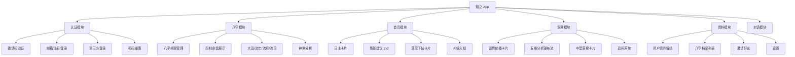

# 知之 ZHIZHI - 产品业务需求文档（简洁版）

**项目**: 知之ZHIZHI - 八字命理 iOS 应用  
**版本**: v1.0  
**文档更新日期**: 2026-02-05  
**说明**: 本文档基于代码库分析整理，用于与后端开发团队讨论API需求

---

## 📑 目录

1. [项目概述](#1-项目概述)
2. [功能模块总览](#2-功能模块总览)
3. [用户认证模块](#3-用户认证模块)
4. [八字档案模块](#4-八字档案模块)
5. [首页模块](#5-首页模块)
6. [洞察分析模块](#6-洞察分析模块)
7. [用户资料模块](#7-用户资料模块)
8. [AI对话模块](#8-ai对话模块)
9. [API接口需求清单](#9-api接口需求清单)
10. [数据模型定义](#10-数据模型定义)

---

## 1. 项目概述

### 1.1 产品定位
知之ZHIZHI是一款基于传统八字命理的智能分析应用，融合现代AI技术，为用户提供：
- 个人八字命盘分析
- 每日/每月/每年运势解读
- AI驱动的场景化建议（事业、感情、健康等）
- 智能追问与深度解析

### 1.2 技术栈
- **前端**: SwiftUI (iOS 17+)
- **架构**: MVVM + Combine
- **认证**: JWT Token (Access + Refresh)

---

## 2. 功能模块总览



---

## 3. 用户认证模块

### 3.1 功能说明

| 功能 | 目的 | 实现方式 |
|-----|------|---------|
| 邀请码验证 | 内测期间限制用户进入 | 用户输入邀请码，前端调用API验证，成功后进入登录/注册页 |
| 邮箱注册 | 新用户创建账户 | 用户输入邮箱→发送验证码→输入验证码+密码→调用注册API→获取Token |
| 密码登录 | 老用户登录 | 用户输入邮箱+密码→调用登录API→获取Token |
| 验证码登录 | 老用户免密登录 | 用户输入邮箱→发送验证码→输入验证码→调用登录API→获取Token |
| 第三方登录 | Apple/Google快捷登录 | 获取OAuth Token→调用社交登录API→已绑定直接登录/新用户需补充信息 |
| 密码重置 | 找回密码 | 用户输入邮箱→发送验证码→输入新密码→调用重置API |

### 3.2 前端字段

- `email` (邮箱)
- `password` (密码)
- `verificationCode` (验证码)
- `invitationCode` (邀请码)
- `displayName` (昵称，可选)
- `socialToken` (第三方Token，可选)

### 3.3 API需求

| 接口 | 方法 | 端点 | 状态 |
|-----|------|-----|------|
| 验证邀请码 | POST | `/api/auth/check-invite-code` | ✅ 已定义 |
| 发送验证码 | POST | `/api/auth/send-code` | ✅ 已定义 |
| 用户注册 | POST | `/api/auth/register` | ✅ 已定义 |
| 用户登录 | POST | `/api/auth/login` | ✅ 已定义 |
| 第三方登录 | POST | `/api/auth/social-login` | ✅ 已定义 |
| Token刷新 | POST | `/api/auth/refresh-token` | ✅ 已定义 |
| 登出 | POST | `/api/auth/logout` | ✅ 已定义 |
| 注销账户 | POST | `/api/auth/delete-account` | ✅ 已定义 |
| 重置密码 | POST | `/api/auth/reset-password` | ✅ 已定义 |

---

## 4. 八字档案模块

### 4.1 业务场景

用户可以创建多个八字档案：
- **本人档案**: 限一个
- **亲友档案**: 多个（父亲、母亲、配偶、子女、朋友等）

### 4.2 功能说明

| 功能 | 目的 | 实现方式 |
|-----|------|---------|
| 创建档案 | 录入出生信息生成八字 | 用户填写姓名/性别/出生时间/地点→提交到后端→后端计算八字并返回完整命盘数据 |
| 浏览档案 | 查看已创建的档案列表 | 进入页面时调用列表API，展示本人+亲友档案 |
| 查看命盘 | 查看详细八字信息 | 点击档案→调用详情API→展示四柱/大运/流年等 |
| 编辑档案 | 修改非核心信息 | 可修改姓名/关系/备注→调用更新API（生辰不可改） |
| 删除档案 | 移除档案 | 确认后调用删除API |

### 4.3 档案创建字段

| 字段 | 类型 | 必填 | 说明 |
|-----|------|-----|------|
| name | String | ✅ | 姓名 |
| gender | Enum | ✅ | 性别：male/female |
| is_owner | Bool | ✅ | 是否本人 |
| relation_to_owner | String | 亲友必填 | 关系：父亲、母亲、配偶、子女等 |
| birth_year | Int | ✅ | 出生年 |
| birth_month | Int | ✅ | 出生月 |
| birth_day | Int | ✅ | 出生日 |
| birth_hour | Int | 可选 | 出生时（0-23） |
| birth_minute | Int | 可选 | 出生分（0-59） |
| is_lunar | Bool | ✅ | 是否农历 |
| birth_timezone | String | ✅ | 时区（默认 Asia/Shanghai） |
| birth_country | String | 可选 | 出生国家 |
| birth_region | String | 可选 | 出生地区（省/市/区） |
| mbti | String | 可选 | MBTI类型 |
| notes | String | 可选 | 备注 |

### 4.4 八字计算结果

后端需要返回的计算结果：

| 字段 | 说明 |
|-----|------|
| bazi_year_stem/branch | 年柱天干/地支 |
| bazi_month_stem/branch | 月柱天干/地支 |
| bazi_day_stem/branch | 日柱天干/地支 |
| bazi_hour_stem/branch | 时柱天干/地支 |
| wuxing_analysis | 五行分析（金木水火土分布） |
| ten_god | 十神 |
| hidden_stems | 藏干 |
| lifecycle | 生命周期（长生十二宫） |
| void_info | 空亡 |
| na_yin | 纳音 |
| shen_sha | 神煞列表 |

### 4.5 API需求

| 接口 | 方法 | 端点 | 状态 |
|-----|------|-----|------|
| 创建档案 | POST | `/api/bazi/create` | ✅ 已定义 |
| 档案列表 | GET | `/api/bazi/list` | ✅ 已定义 |
| 档案详情 | GET | `/api/bazi/{id}` | ✅ 已定义 |
| 更新档案 | PUT | `/api/bazi/{id}` | ✅ 已定义 |
| 删除档案 | DELETE | `/api/bazi/{id}` | ✅ 已定义 |

---

## 5. 首页模块

### 5.1 功能说明

| 功能 | 目的 | 实现方式 |
|-----|------|---------|
| 日主卡片 | 展示今日基础运势信息 | 进入首页时调用每日运势API，展示日期+日主+核心提示 |
| 场景建议 | 展示当日最相关的运势场景 | 后端返回2个最相关场景（如事业、感情），每个场景2条建议 |
| 深度下钻 | 获取建议的详细分析 | 用户点击建议按钮→确认消耗积分→调用AI接口→前端流式展示返回的文案 |
| AI自由问答 | 用户输入任意问题获取分析 | 用户输入问题→确认消耗积分→调用AI接口→流式展示回复 |

### 5.2 场景类型

| 场景 | 中文 | 图标 | 颜色 |
|-----|------|-----|------|
| career | 事业 | 💼 | #1B4F72 |
| love | 感情 | ❤️ | #C0392B |
| overall | 整体 | ☯️ | #7D3C98 |
| study | 学习 | 📚 | #1E8449 |
| health | 健康 | 🌿 | #D68910 |

### 5.3 数据结构

```swift
SceneAdvice {
    scene: FortuneScene  // 场景类型
    changeLevel: String  // "变化较大" / "变化中等" / "变化较小"
    advices: [AdviceItem]  // 建议列表
}

AdviceItem {
    title: String   // 标题（如"木气偏弱，适合处理文书工作"）
    detail: String  // 详细内容（80-120字）
}
```

### 5.4 API需求

| 接口 | 方法 | 端点 | 状态 | 说明 |
|-----|------|-----|------|------|
| 获取每日运势 | GET | `/api/fortune/daily` | ❌ 待开发 | 返回日主+场景建议 |
| 获取场景详情 | GET | `/api/fortune/scene/{scene}` | ❌ 待开发 | 获取单个场景详细分析 |
| AI问答 | POST | `/api/ai/chat` | ❌ 待开发 | 流式返回AI回复 |

---

## 6. 洞察分析模块

### 6.1 功能说明

| 功能 | 目的 | 实现方式 |
|-----|------|---------|
| 运势轮播卡片 | 展示五大维度运势概览 | 调用卡片API，左右滑动切换（整体/财运/感情/事业/健康） |
| 分析瀑布流 | 展示五个命格分析维度 | 调用分析API，网格展示5个分析卡片 |
| 详细分析 | 获取某一维度的深度分析 | 点击卡片→确认消耗积分→调用详情API→展示核心金句+详细建议 |
| AI追问 | 对某个分析结果深度追问 | 点击追问按钮→确认消耗积分→调用追问API→展示分段回答 |

### 6.2 数据结构

```swift
// 轮播卡片
SwipeableInsightCard {
    category: String      // 类别
    title: String         // 标题
    description: String   // 描述
    question: String      // 引导问题
    gradient: Gradient    // 渐变背景
    videoName: String     // 视频背景（可选）
}

// 中型洞察卡片
MediumInsightCard {
    contextTitle: String        // 语境锚点
    goldenSentence: String      // 核心断语（5-10字金句）
    detailedContent: String     // 详细建议（80-120字，支持高亮语法）
    followUpQuestions: [String] // 追问问题（2个）
}

// 追问回复
FollowUpResponse {
    question: String            // 追问的问题
    sections: [FollowUpSection] // 分段回答
}
```

**高亮语法**: `[text]{highlight}` 会被渲染为高亮文本

### 6.3 API需求

| 接口 | 方法 | 端点 | 状态 | 说明 |
|-----|------|-----|------|------|
| 获取运势卡片 | GET | `/api/insights/cards` | ❌ 待开发 | 返回轮播卡片数据 |
| 获取分析项 | GET | `/api/insights/analysis` | ❌ 待开发 | 返回五维分析数据 |
| 获取详细分析 | GET | `/api/insights/detail/{category}` | ❌ 待开发 | 返回MediumInsightCard |
| AI追问 | POST | `/api/insights/followup` | ❌ 待开发 | 返回FollowUpResponse |

---

## 7. 用户资料模块

### 7.1 功能说明

| 功能 | 目的 | 实现方式 |
|-----|------|---------|
| 资料展示 | 展示用户个人信息 | 调用资料API，展示头像/昵称/简介/统计数据 |
| 资料编辑 | 修改个人信息 | 用户编辑各字段→调用更新API保存 |
| 邀请好友 | 推广获取奖励 | 调用邀请码API获取个人邀请码→分享给好友→查看邀请记录 |

### 7.2 用户资料字段

| 字段 | 类型 | 说明 |
|-----|------|------|
| nickname | String | 昵称 |
| dayMaster | String | 日主 |
| gender | String | 性别 |
| zodiac | String | 生肖（如"龙"） |
| tags | [String] | 标签（如["配偶", "VIP"]） |
| notes | String | 备注/生活事件 |
| location | String | 所在地 |
| age | Int | 年龄 |
| bio | String | 个人简介 |
| career | String | 职业 |
| school | String | 学校 |
| mbti | String | MBTI类型 |
| footprintCount | Int | 总点击卡片数 |
| pointsBalance | Int | 账户积分余额 |

### 7.3 API需求

| 接口 | 方法 | 端点 | 状态 | 说明 |
|-----|------|-----|------|------|
| 获取用户资料 | GET | `/api/user/profile` | ✅ 已定义 | 基础字段 |
| 更新用户资料 | PUT | `/api/user/profile` | ✅ 已定义 | 基础字段 |
| 获取邀请码 | GET | `/api/user/invite-code` | ❌ 待开发 | 获取用户邀请码 |
| 邀请记录 | GET | `/api/user/invitations` | ❌ 待开发 | 获取邀请历史 |
| 更新扩展资料 | PUT | `/api/user/profile/extended` | ❌ 待开发 | 职业、MBTI等 |

---

## 8. AI对话模块

### 8.1 功能说明

| 功能 | 目的 | 实现方式 |
|-----|------|---------|
| 发送问题 | 用户向AI提问 | 用户输入问题→确认消耗积分→调用AI接口发送问题 |
| 流式回复 | 实时展示AI回答 | 后端通过SSE流式返回→前端逐字展示 |
| 后续建议 | 引导用户继续追问 | AI回复完成后返回2-3个推荐问题 |
| 对话历史 | 查看历史对话 | 调用历史API获取对话记录 |

### 8.2 对话数据结构

```swift
ChatMessage {
    content: String    // 消息内容
    isFromUser: Bool   // 是否用户发送
}
```

### 8.3 API需求

| 接口 | 方法 | 端点 | 状态 | 说明 |
|-----|------|-----|------|------|
| 发送消息 | POST | `/api/chat/send` | ❌ 待开发 | 发送用户问题 |
| 获取回复 | GET/SSE | `/api/chat/stream` | ❌ 待开发 | 流式返回AI回复 |
| 对话历史 | GET | `/api/chat/history` | ❌ 待开发 | 获取历史对话 |

---

## 9. API接口需求清单

### 9.1 已实现接口 ✅

| 模块 | 接口 | 端点 |
|-----|------|-----|
| 认证 | 验证邀请码 | `POST /api/auth/check-invite-code` |
| 认证 | 发送验证码 | `POST /api/auth/send-code` |
| 认证 | 用户注册 | `POST /api/auth/register` |
| 认证 | 用户登录 | `POST /api/auth/login` |
| 认证 | 第三方登录 | `POST /api/auth/social-login` |
| 认证 | 刷新Token | `POST /api/auth/refresh-token` |
| 认证 | 登出 | `POST /api/auth/logout` |
| 认证 | 注销账户 | `POST /api/auth/delete-account` |
| 认证 | 重置密码 | `POST /api/auth/reset-password` |
| 用户 | 获取资料 | `GET /api/user/profile` |
| 八字 | 创建档案 | `POST /api/bazi/create` |
| 八字 | 档案列表 | `GET /api/bazi/list` |
| 八字 | 档案详情 | `GET /api/bazi/{id}` |
| 八字 | 更新档案 | `PUT /api/bazi/{id}` |
| 八字 | 删除档案 | `DELETE /api/bazi/{id}` |

### 9.2 待开发接口 ❌

| 优先级 | 模块 | 接口 | 端点 | 说明 |
|-------|-----|------|-----|------|
| P0 | 运势 | 每日运势 | `GET /api/fortune/daily` | 首页核心数据 |
| P0 | 洞察 | 运势卡片 | `GET /api/insights/cards` | 洞察页核心 |
| P0 | 洞察 | 分析数据 | `GET /api/insights/analysis` | 五维分析 |
| P1 | 洞察 | 详细分析 | `GET /api/insights/detail/{category}` | 中型卡片 |
| P1 | 洞察 | AI追问 | `POST /api/insights/followup` | 追问系统 |
| P1 | AI | 发送消息 | `POST /api/chat/send` | AI对话 |
| P1 | AI | 流式回复 | `GET/SSE /api/chat/stream` | 流式输出 |
| P2 | 运势 | 场景详情 | `GET /api/fortune/scene/{scene}` | 场景分析 |
| P2 | 用户 | 邀请码 | `GET /api/user/invite-code` | 邀请功能 |
| P2 | 用户 | 邀请记录 | `GET /api/user/invitations` | 邀请历史 |
| P2 | AI | 对话历史 | `GET /api/chat/history` | 历史记录 |
| P3 | 用户 | 扩展资料 | `PUT /api/user/profile/extended` | MBTI等 |

---

## 10. 数据模型定义

### 10.1 运势场景 (FortuneScene)

```json
{
    "scene": "career",  // career|love|overall|study|health
    "changeLevel": "变化较大",
    "advices": [
        {
            "title": "木气偏弱，适合处理文书工作",
            "detail": "详细建议内容..."
        }
    ]
}
```

### 10.2 中型洞察卡片 (MediumInsightCard)

```json
{
    "contextTitle": "整体运势",
    "goldenSentence": "静待时机，稳中求进",
    "detailedContent": "本月运势如[春水初融]{highlight}，表面平静之下暗流涌动...",
    "followUpQuestions": ["有何风险需防范？", "何时可主动出击？"]
}
```

### 10.3 追问回复 (FollowUpResponse)

```json
{
    "question": "最近会有桃花运吗？",
    "sections": [
        {
            "title": "桃花运势",
            "content": "从八字流年来看，今年[红鸾星动]{highlight}..."
        },
        {
            "title": "缘分方位",
            "content": "利于在[东南方向]{highlight}寻觅良缘..."
        }
    ]
}
```

### 10.4 四柱数据 (PillarData)

```json
{
    "name": "年柱",
    "tenGod": "正财",
    "stem": "乙",
    "stemElement": "wood",
    "branch": "亥",
    "branchElement": "water",
    "hiddenStems": [
        {"stem": "壬", "tenGod": "食神", "element": "water"},
        {"stem": "甲", "tenGod": "偏财", "element": "wood"}
    ],
    "lifecycle": "死",
    "voidInfo": "申酉",
    "naYin": "山头火",
    "shenSha": ["太极贵人", "亡神", "天厨贵人"]
}
```

### 10.5 大运/流年/流月/流日

```json
// 大运 (MajorCycle)
{
    "startYear": 2025,
    "age": 31,
    "stem": "癸",
    "branch": "未",
    "tenGod": "伤"
}

// 流年 (AnnualLuck)
{
    "year": 2026,
    "stem": "丙",
    "branch": "午",
    "tenGodTop": "官",
    "tenGodBottom": "杀"
}

// 流月 (MonthlyLuck)
{
    "month": 2,
    "stem": "庚",
    "branch": "寅",
    "tenGod": "比"
}
```

---

## 📝 附录：现有 API 契约

详细的 API 契约文档请参考：[API-CONTRACT.md](file:///Users/hangdongguo/Desktop/ZHIZHI/ZHI9.25/API-CONTRACT.md)

---

> [!IMPORTANT]
> **与后端讨论重点**:
> 1. **AI接口设计**: 确认流式输出方案（SSE vs WebSocket）
> 2. **运势计算**: 确认八字计算算法库/服务
> 3. **缓存策略**: 每日运势是否需要缓存
> 4. **高亮语法**: 确认 `[text]{highlight}` 是前端处理还是后端返回HTML
> 5. **积分消耗**: 需要新增积分扣减/查询接口
