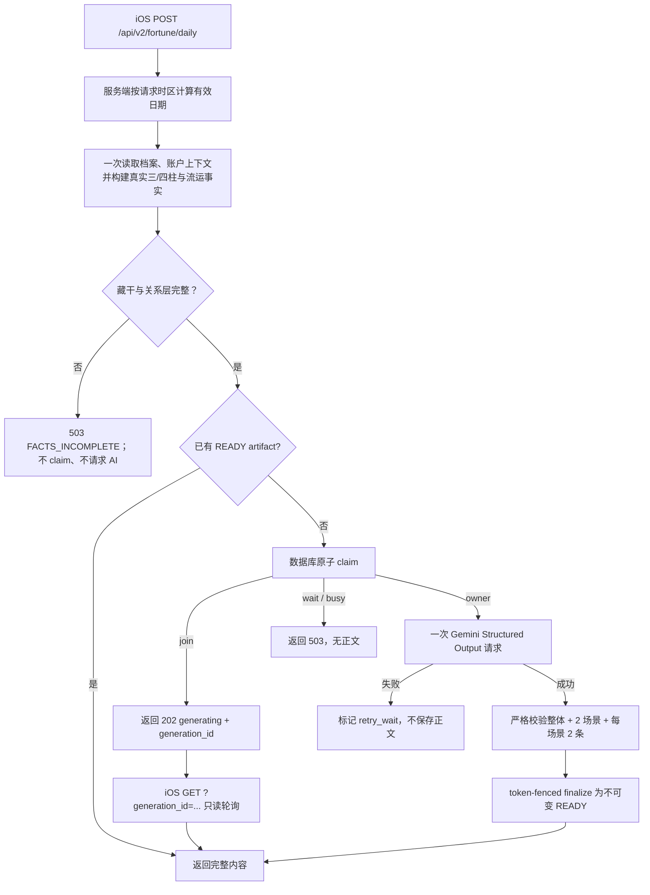

# 首页日运 V2：AI 全推断、一次生成、完整内容预缓存

状态：后端 V2 代码与测试已完成；上线前需执行 `011`、`012` 迁移并接入 iOS 首页。

## 1. 产品合同

首页日运由一次 AI 请求同时生成：

- 一份完整的「今日判断」；
- 从 `career`、`love`、`health`、`study`、`wealth` 中选出的两个主要场景；
- 每个入选场景的两条完整事项。

命理引擎只提供事实，不负责场景选择、吉凶评分或正文推断。AI 负责全部推断和全部正文。未入选的三个场景不生成内容。

用户点击卡片只展开已经缓存的完整内容，不触发第二次 AI 请求，也不代表打卡。

AI 或结构校验失败时，不保存任何正文。接口返回不可用状态，后续由客户端重新发起 `POST`。

## 2. 数据边界

服务端将下列事实组装为一个 AI 输入：

- 档案基础资料与日主；
- 实际保存的三柱或四柱；
- 每个真实地支对应的完整藏干：藏干天干、相对日主十神、五行；
- 当前大运、流年、流月、流日及其完整藏干；
- 原局与流运的结构化刑、冲、合、害、破、三合、三会、半合、拱合、暗合等作用关系；
- 结构化现实上下文：MBTI、人生阶段、职业/学业状态、关系状态，以及已保存的知之理解快照。

三柱档案的 `pillars` 数组只有年、月、日三项。四柱档案才包含时柱。日运服务没有 `hour_known` / `hour_unknown` 推断分支，也不会把内部计算 fallback 时柱传给 AI。关系计算会先移除三柱档案的内部 fallback 时柱，因此原局关系和流运关系都只基于真实年月日。

每个存在真实地支的命局柱、大运、流年、流月、流日都必须带非空藏干；任一藏干都必须含天干、相对日主十神和五行。缺失、残缺或作用关系层不完整时，服务在数据库 claim 和 AI 请求之前返回 `FACTS_INCOMPLETE`，不会缓存任何正文。

日运事实包刻意不含格局候选、用神、AI brief、展示型 `fact_panel`、证据文本或场景预判。这样 AI 只从确定性命理事实选择 Top 2，而不是被旧的格局摘要或预设场景偏置。

现实上下文不改变命理事实和 Top 2 的主判断：它只把已经成立的变化翻译为用户更可识别的工作、关系、学习或日常情境。本人档案可回退使用账户的 MBTI、职业、学校；亲友档案绝不混入主账户资料。原始备注、简介和点击日志不会传给 AI。

### 2.1 档案上下文写入合同

通过现有 `POST /api/bazi/create` 或 `PUT /api/bazi/:id` 的 `daily_fortune_context` 写入。它是每个八字档案自己的快照，不是账号级通用备注：

```json
{
  "daily_fortune_context": {
    "life_stage": {
      "primary": "职业转换期",
      "tags": ["换岗准备"]
    },
    "work_study": {
      "mode": "career",
      "occupation": "产品经理",
      "industry": "互联网",
      "current_goal": "完成作品集"
    },
    "relationship": {
      "status": "恋爱中",
      "current_focus": "沟通节奏"
    },
    "zhizhi_understanding": {
      "snapshot_version": "v1",
      "current_focus": ["减少无效加班"],
      "expression_preferences": ["直接给行动建议"],
      "behavior_signals": ["近期任务密集"],
      "updated_at": "2026-07-23T08:00:00.000Z"
    }
  }
}
```

`work_study.mode` 只允许 `career`、`study`、`both`、`transition`、`none`。所有字段可以缺省；缺省不阻断日运生成，AI 会使用中性、条件化表达。

AI 输出不包含证据、推理过程、fallback 文本、昨日反馈或额外场景。

## 3. 日期和缓存身份

有效日期按客户端提交的 IANA 时区在服务端计算，采用当地时间 23:00 子初换日：

- 22:59 仍属于当日；
- 23:00 起使用下一日干支和下一份日运。

同一份内容的身份为：

`user_id + profile_id + effective_date + profile_revision_hash`

`profile_revision_hash` 包含命理事实快照、规范化后的日运上下文、事实契约版本、Prompt 版本和生成配置版本。MBTI、职业/学业、关系状态或知之理解快照变化后，同一天会生成新内容；姓名、备注、头像等展示字段不会触发重新生成。

## 4. 请求流程



`GET` 只读取已有生成记录，不 claim、不构建命理事实、不调用 AI。

## 5. HTTP 合同

### POST `/api/v2/fortune/daily`

请求：

```json
{
  "bazi_profile_id": "uuid",
  "timezone": "Asia/Hong_Kong"
}
```

可能结果：

- `200 ready`：包含完整 `overall` 和两个 `selected_scenes`；
- `202 generating`：包含 `generation_id` 与建议轮询时间；
- `503 unavailable`：没有任何正文，客户端稍后重新 `POST`。

### GET `/api/v2/fortune/daily?generation_id=...`

可能结果：

- `200 ready`：完整内容；
- `202 generating`：继续轮询；
- `200 missing`：该次生成没有可读取正文，客户端重新 `POST`；
- `404`：记录不存在或不属于当前用户。

所有响应均设置 `Cache-Control: private, no-store`。READY 内容由 App 自己持久化，不依赖共享 HTTP 缓存。

## 6. 存储和并发

`daily_fortune_artifacts` 保存生成身份、状态、事实快照、完整 AI 内容和生成版本。

- `generating`：持有有期限的 lease；
- `retry_wait`：没有正文，允许到期后重新 claim；
- `ready`：内容完整且不可变。

数据库 RPC 原子执行 claim、过期 lease 接管、失败等待和 finalize。`lease_token + lease_epoch` 防止较慢的旧请求覆盖较新的生成结果。

## 7. 运行配置

首页日运 V2 需要：

- `GEMINI_API_KEY`
- `DAILY_FORTUNE_AI_MODEL`
- `DAILY_FORTUNE_V2_GENERATION_ENABLED=true`

可选：

- `DAILY_FORTUNE_AI_TIMEOUT_MS`
- `DAILY_FORTUNE_MAX_ACTIVE_GENERATIONS`

该链路没有 Mock 或示例 fallback。关闭生成开关后仍可以读取已生成的 READY artifact。

## 8. 上线顺序

1. 执行 `011_daily_fortune_artifacts.sql` 和 `012_daily_fortune_user_context.sql`。
2. 配置固定 Gemini 模型与环境变量。
3. 部署后端并验证三柱、四柱、藏干缺失、上下文变更、POST/GET、AI 失败和并发请求。
4. iOS 接入本地完整内容缓存与点击展开。
5. 小流量开启生成，再扩大范围。
